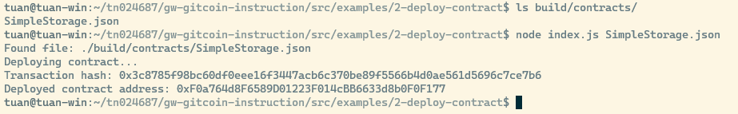

# Task 2: Deploy A Simple Ethereum Smart Contract On Polyjuice

https://gitcoin.co/issue/nervosnetwork/grants/3/100026209

1. Screenshot



2. Transaction hash
```
0x3c8785f98bc60df0eee16f3447acb6c370be89f5566b4d0ae561d5696c7ce7b6
```

3. Contract address
```
0xF0a764d8F6589D01223F014cBB6633d8b0F0F177
```