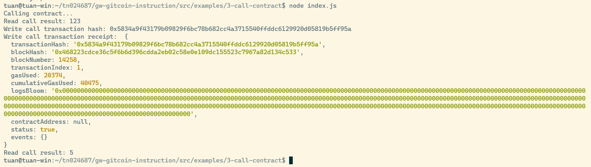

# Task 3: Issue A Smart Contract Call To The Deployed Smart Contract

https://gitcoin.co/issue/nervosnetwork/grants/4/100026210

1. Screenshot



2. Transaction hash
```
0x5834a9f43179b09829f6bc78b682cc4a3715540ffddc6129920d05819b5ff95a
```

3. Contract address
```
0xF0a764d8F6589D01223F014cBB6633d8b0F0F177
```

4. ABI
```
const CONTRACT_ABI = [
    {
      "inputs": [],
      "stateMutability": "payable",
      "type": "constructor"
    },
    {
      "inputs": [
        {
          "internalType": "uint256",
          "name": "x",
          "type": "uint256"
        }
      ],
      "name": "set",
      "outputs": [],
      "stateMutability": "payable",
      "type": "function"
    },
    {
      "inputs": [],
      "name": "get",
      "outputs": [
        {
          "internalType": "uint256",
          "name": "",
          "type": "uint256"
        }
      ],
      "stateMutability": "view",
      "type": "function"
    }
];
```
