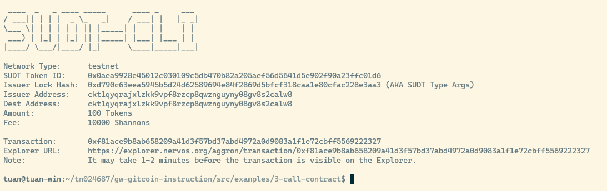
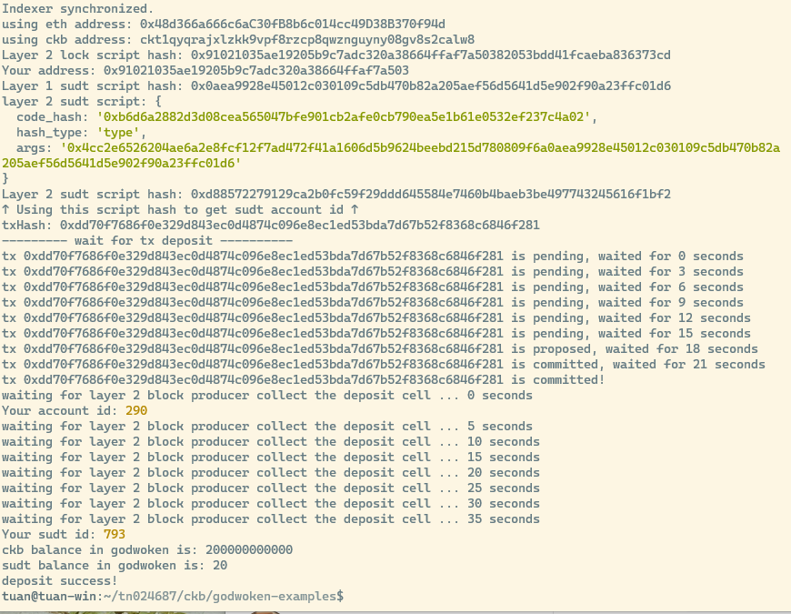

# Task 4: Issue An SUDT Token On Layer 1 And Deposit It To Layer 2

https://gitcoin.co/issue/nervosnetwork/grants/5/100026211

1. A link to the Layer 1 address you funded on the Testnet Explorer

https://explorer.nervos.org/aggron/address/ckt1qyqrajxlzkk9vpf8rzcp8qwznguyny08gv8s2calw8

2. Screenshot of `sudt-cli`



3. Transaction ID

https://explorer.nervos.org/aggron/transaction/0xf81ace9b8ab658209a41d3f57bd37abd4972a0d9083a1f1e72cbff5569222327

4. Screenshot of a deposit to Layer 2 using the `account-cli`



5. SUDT ID
```
793
```