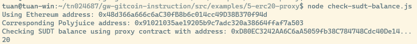

# Task 5: Deploy The ERC20 Proxy Contract For The Deposited SUDT

https://gitcoin.co/issue/nervosnetwork/grants/6/100026212

1. Screenshot of deployed smart contract


2. Address of ERC20 Proxy Contract
```
0xD80EC3242AA6C6aA5059fb38C784748Cdc40De14
```

3. Screenshot of checking SUDT balance



4. Ethereum address
```
0x48d366a666c6aC30fB8b6c014cc49D38B370f94d
```