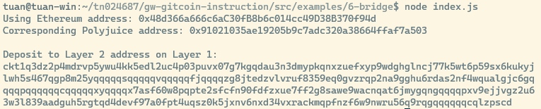

# Task 6: Use Force Bridge To Deposit Tokens From Ethereum To Polyjuice

https://gitcoin.co/issue/nervosnetwork/grants/7/100026213

1. Screenshot of Deposit Receiver Address



2. Deposit Receiver Address
```
ckt1q3dz2p4mdrvp5ywu4kk5edl2uc4p03puvx07g7kgqdau3n3dmypkqnxzuefxyp9wdghglncj77k5wt6p59sx6kukyjlwh5s467qgp8m25yqqqqqsqqqqqvqqqqqfjqqqqzg8jtedzvlvruf8359eq0gvzrqp2na9gghu6rdas2nf4wqualgjc6gqqqqpqqqqqqcqqqqqxyqqqqx7asf60w8pqpte2sfcfn90fdfzxue7ff2g8sawe9wacnqat6jmygqngqqqqpxv9ejjvgz2u63w3l839aadguh5rgtqd4devf97a0fpt4uqsz0k5jxnv6nxd34vxrackmqpfnzf6w9nwru56q9rqgqqqqqqcqlzpscd
```

3. Ethereum address used to generate the Deposit Receiver Address
```
0x48d366a666c6aC30fB8b6c014cc49D38B370f94d
```

4. Etherscan explorer : Force Bridge transaction

https://rinkeby.etherscan.io/tx/0xab0846f473a603278c627f51bc4ec71e436d814644bc2804fa7c0cb110671d4b

5. Nervos explorer: Force bridge transaction

https://explorer.nervos.org/aggron/transaction/0x79565dbe8ba501ef1852da30450aeb9e41c6233cb9cef5676019e70025198322
