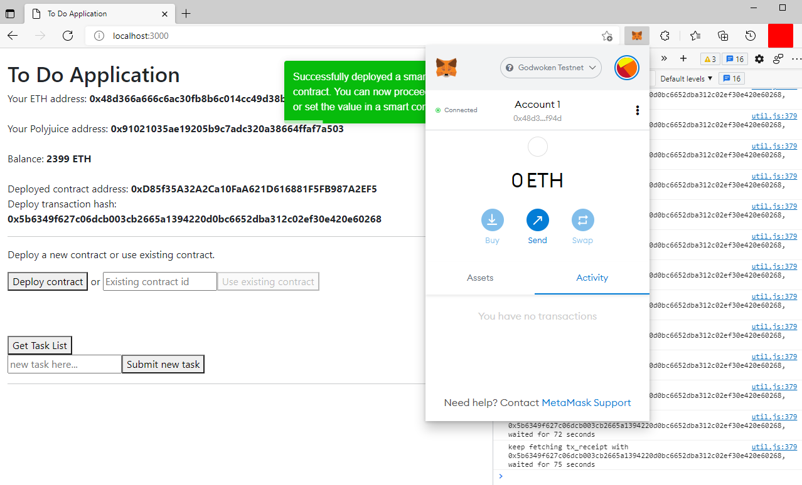
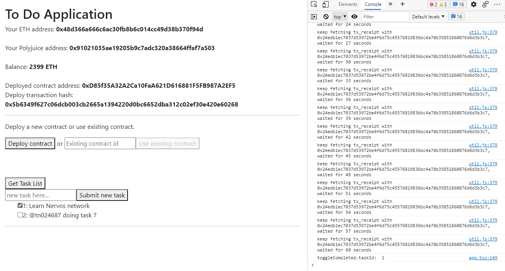

# Task 7: Port An Existing Ethereum DApp To Polyjuice

https://gitcoin.co/issue/nervosnetwork/grants/8/100026214

1. Screenshots of application running on Godwoken





2. GitHub repository

Github: [tn024687/nervos-app](https://github.com/tn024687/nervos-app)

3. Contracts 
Transaction hash of the deployment transaction
```
0x5b6349f627c06dcb003cb2665a1394220d0bc6652dba312c02ef30e420e60268
```

Contract address
```
0xD85f35A32A2Ca10FaA621D616881F5FB987A2EF5
```

ABI of the deployed smart contract
```
"abi": [
  {
    "inputs": [],
    "stateMutability": "nonpayable",
    "type": "constructor"
  },
  {
    "anonymous": false,
    "inputs": [
      {
        "indexed": false,
        "internalType": "uint256",
        "name": "id",
        "type": "uint256"
      },
      {
        "indexed": false,
        "internalType": "bool",
        "name": "completed",
        "type": "bool"
      }
    ],
    "name": "TaskCompleted",
    "type": "event"
  },
  {
    "anonymous": false,
    "inputs": [
      {
        "indexed": false,
        "internalType": "uint256",
        "name": "id",
        "type": "uint256"
      },
      {
        "indexed": false,
        "internalType": "string",
        "name": "content",
        "type": "string"
      },
      {
        "indexed": false,
        "internalType": "bool",
        "name": "completed",
        "type": "bool"
      }
    ],
    "name": "TaskCreated",
    "type": "event"
  },
  {
    "inputs": [],
    "name": "taskCount",
    "outputs": [
      {
        "internalType": "uint256",
        "name": "",
        "type": "uint256"
      }
    ],
    "stateMutability": "view",
    "type": "function"
  },
  {
    "inputs": [
      {
        "internalType": "uint256",
        "name": "",
        "type": "uint256"
      }
    ],
    "name": "tasks",
    "outputs": [
      {
        "internalType": "uint256",
        "name": "id",
        "type": "uint256"
      },
      {
        "internalType": "string",
        "name": "content",
        "type": "string"
      },
      {
        "internalType": "bool",
        "name": "completed",
        "type": "bool"
      }
    ],
    "stateMutability": "view",
    "type": "function"
  },
  {
    "inputs": [
      {
        "internalType": "string",
        "name": "_content",
        "type": "string"
      }
    ],
    "name": "createTask",
    "outputs": [],
    "stateMutability": "nonpayable",
    "type": "function"
  },
  {
    "inputs": [
      {
        "internalType": "uint256",
        "name": "_id",
        "type": "uint256"
      }
    ],
    "name": "toggleCompleted",
    "outputs": [],
    "stateMutability": "nonpayable",
    "type": "function"
  }
]
```